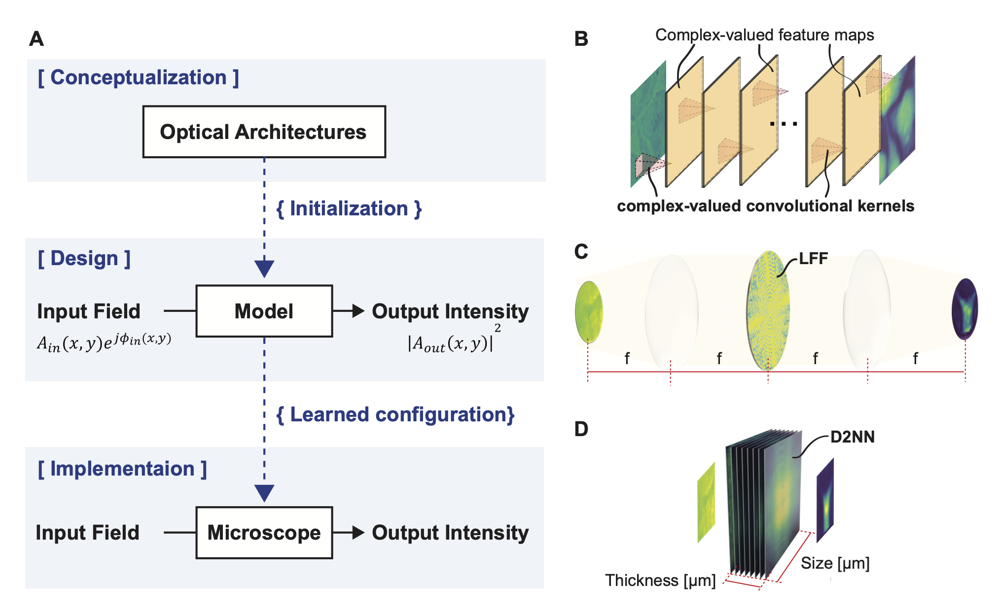

# Differentiable Microscopy Designs an All Optical Phase Retrieval Microscope


We introduce Differentiable Microscopy ($\partial \mu$), a deep learning-based top-down design paradigm for optical microscopes. Using all-optical phase retrieval as an illustrative example, we demonstrate the effectiveness of data-driven microscopy design through $\partial \mu$. Furthermore, we conduct comprehensive comparisons with competing methods, showcasing the consistent superiority of our learned designs across multiple datasets, including biological samples. This repository contains the official PyTorch implementation of our designs. 

<div align="center">
  
</div>

## Running Pretrained Models (To be Updated)

Here we provide the Google Colab notebooks to reproduce the results of our best performing models for each dataset for our microscopy designs.

- <b>Expected results of each notebook :</b>
  - SSIM score for the unseen dataset. SSIM values should match the below table.
  - Groundruth and the corresponding reconstructed images will be printed in the notebooks
- <b>Expected runtime for Setting up and Inference on Colab</b> : ~2 Minutes (Make sure to select a GPU runtime)
- <b>Expected runtime for Inference on a normal desktop with GPU</b> : \<to be updated\>

### Performance of complex-valued linear CNNs (SSIM)
| Method                    | MNIST [0, Pi]  | MNIST [0, 2Pi] | HeLa [0,Pi] | HeLa [0,2Pi] | Bacteria [0, Pi] | Colab Notebook |
|---------------------------|----------------|----------------|-------------|--------------|------------------|----------------|
| Complex-valued linear CNN |     0.9982     |     0.7913     |    0.9417   |   0.8619     |      0.9938      | <a href="https://colab.research.google.com/github/Bantami/All-Optical-QPM/blob/main/Colab/cnn_inference_colab.ipynb" target="_blank"></a>               |

### Performance of Optical Models (SSIM)

| Method                           | MNIST [0, Pi]  | MNIST [0, 2Pi] | HeLa [0,Pi] | HeLa [0,2Pi] | Bacteria [0, Pi] | Colab Notebook |
|----------------------------------|----------------|----------------|-------------|--------------|------------------|----------------|
| LFF                              |     0.9205     |     0.6814     |    0.7783   |   0.6078     |      0.9823      | <a href="https://colab.research.google.com/github/Bantami/All-Optical-QPM/blob/main/Colab/lff_pretrained_model_inference_colab.ipynb" target="_blank"></a>               |
| GPC                              |     0.9036     |     0.4406     |    0.7786   |   0.5509     |      0.9600      | <a href="https://colab.research.google.com/github/Bantami/All-Optical-QPM/blob/main/Colab/GPC_baseline_inference_colab.ipynb" target="_blank"></a>                |
| D2NN                             |     0.9433     |     0.7703     |    0.6655   |   0.4942     |      0.9926      |    <a href="https://colab.research.google.com/github/Bantami/All-Optical-QPM/blob/main/Colab/d2nn_pretrained_model_inference_colab.ipynb" target="_blank"></a>            |
| Phase-LFF                        |     0.9177     |     0.6777     |    0.7771   |   0.6096     |      0.9825      | <a href="https://colab.research.google.com/github/Bantami/All-Optical-QPM/blob/main/Colab/lff_pretrained_model_inference_colab.ipynb" target="_blank"></a>               |
| Phase-LRF                        |     0.8573     |     0.6211     |    0.7583   |   0.6078     |      0.9508      | <a href="https://colab.research.google.com/github/Bantami/All-Optical-QPM/blob/main/Colab/lff_pretrained_model_inference_colab.ipynb" target="_blank"></a>               |
| Phase-GPC                        |     0.8466     |     0.4191     |    0.7297   |   0.5184     |      0.9479      | <a href="https://colab.research.google.com/github/Bantami/All-Optical-QPM/blob/main/Colab/GPC_baseline_inference_colab.ipynb" target="_blank"></a>                |
| Phase-D2NN                       |     0.8796     |     0.6906     |    0.6334   |   0.4191     |      0.9867      |    <a href="https://colab.research.google.com/github/Bantami/All-Optical-QPM/blob/main/Colab/PhaseD2NN_pretrained_model_inference_colab.ipynb" target="_blank"></a>            |


## Training Models

### 1. Clone the repository

```bash
git clone https://github.com/Bantami/All-Optical-QPM.git
```

### 2. Download HeLa and Bacteria datasets and set data_dir path in `dataloaders.py`

[HeLa dataset link](https://drive.google.com/file/d/16vYiOBYJ8BDCBVHoOv6eqcXaLQhiS8Ik/view?usp=share_link), [Bacteria dataset link](https://drive.google.com/file/d/12AdUSF7DawnqVJMzfPzqD7mUa7kmZT2L/view?usp=share_link)

To download the dataset through the commandline, follow the below steps

```bash
pip install gdown
gdown https://drive.google.com/uc?id=16vYiOBYJ8BDCBVHoOv6eqcXaLQhiS8Ik
gdown https://drive.google.com/uc?id=12AdUSF7DawnqVJMzfPzqD7mUa7kmZT2L

mkdir datasets/
unzip -qq hela.zip -d datasets/
unzip -qq bacteria.zip -d datasets/

```

Update `dataloaders.py` to set,
- MNIST `data_dir` (any existing path will work) in line [30](https://github.com/wadduwagelab/All-Optical-QPM/blob/2d15f2d381f3255a213599c7b850cc6d6791a86d/modules/dataloaders.py#L30)
and 
- HeLa `data_dir` in line [60](https://github.com/wadduwagelab/All-Optical-QPM/blob/2d15f2d381f3255a213599c7b850cc6d6791a86d/modules/dataloaders.py#L60)
- Bacteria `data_dir` in line [89](https://github.com/wadduwagelab/All-Optical-QPM/blob/2d15f2d381f3255a213599c7b850cc6d6791a86d/modules/dataloaders.py#L89)


### 3. Setting up a new environment and adding the kernel to Jupyter

* This should take only few minutes

```bash
## create new environment
conda create -n qpm_env python=3.6
source activate qpm_env

## Adding new environment to JupyterLab
conda install -c anaconda ipykernel -y
python -m ipykernel install --user --name=qpm_env

conda install pytorch==1.8.0 torchvision==0.9.0 torchaudio==0.8.0 cudatoolkit=11.1 -c pytorch -c nvidia
conda install -c conda-forge matplotlib
conda install -c conda-forge wandb

#install remaining packages through pip
pip install -r requirements.txt
```

### 4. Training the Optical/Baseline Models for Different Datasets


Please find the training notebooks for each of the models for each dataset below.

> run notebook_name.ipynb after selecting the newly added kernal (qpm_env)

> results will be saved in the folder "results" which will be created in the parent directory w.r.t to where the notebook is located.

- Expected results of each training notebook (in `results` folder):
  - Saved model for latest epoch
  - Loss curves figure
  - Input/Reconstructed images comparison figure for each epoch (SSIM, L1, BerHu loss will be displayed)


#### Learnable Fourier Filter (LFF)
- [LFF - MNIST [0,Pi]](https://github.com/wadduwagelab/All-Optical-QPM/blob/main/Notebooks/LearnableFourierFilter/LFF_MNIST.ipynb)
- [LFF - MNIST [0,2Pi]](https://github.com/wadduwagelab/All-Optical-QPM/blob/main/Notebooks/LearnableFourierFilter/LFF_MNIST_2pi.ipynb)
- [LFF - HeLa [0,Pi]](https://github.com/Bantami/All-Optical-QPM/blob/main/Notebooks/LearnableFourierFilter/LFF_HeLA_pi.ipynb)
- [LFF - HeLa [0,2Pi]](https://github.com/Bantami/All-Optical-QPM/blob/main/Notebooks/LearnableFourierFilter/LFF_HeLA.ipynb)
- [LFF - Bacteria](https://github.com/wadduwagelab/All-Optical-QPM/blob/main/Notebooks/LearnableFourierFilter/LFF_Bacteria.ipynb)

#### D2NN  
- [PhaseD2NN - MNIST](https://github.com/Bantami/All-Optical-QPM/blob/main/Notebooks/PhaseD2NN/PhaseD2NN_mnist.ipynb)
- [PhaseD2NN - HeLa [0,Pi]](https://github.com/Bantami/All-Optical-QPM/blob/main/Notebooks/PhaseD2NN/PhaseD2NN_hela_pi.ipynb) 
- [PhaseD2NN - HeLa [0,2Pi]](https://github.com/Bantami/All-Optical-QPM/blob/main/Notebooks/PhaseD2NN/PhaseD2NN_hela_2pi.ipynb)

#### Complex-valued linear CNN
- [Complex-CNN - MNIST [0,Pi]](https://github.com/Bantami/All-Optical-QPM/blob/main/Notebooks/ComplexCNN/complexCNN_MNIST.ipynb)
- [Complex-CNN - MNIST [0,2Pi]](https://github.com/wadduwagelab/All-Optical-QPM/blob/main/Notebooks/ComplexCNN/complexCNN_MNIST_2pi.ipynb)
- [Complex-CNN - HeLa [0,Pi]](https://github.com/Bantami/All-Optical-QPM/blob/main/Notebooks/ComplexCNN/complexCNN_HeLA_pi.ipynb)
- [Complex-CNN - HeLa [0,2Pi]](https://github.com/Bantami/All-Optical-QPM/blob/main/Notebooks/ComplexCNN/complexCNN_HeLA.ipynb)
- [Complex-CNN - Bacteria](https://github.com/wadduwagelab/All-Optical-QPM/blob/main/Notebooks/ComplexCNN/complexCNN_Bacteria.ipynb)


## Directory Structure:

```

├── Colab
│   ├── cnn_inference_colab.ipynb
│   ├── d2nn_pretrained_model_inference_colab.ipynb
│   ├── GPC_baseline_inference_colab.ipynb
│   └── lff_pretrained_model_inference_colab.ipynb
├── colab_setup.sh
├── modules
│   ├── d2nn_layers.py
│   ├── d2nn_models.py
│   ├── dataloaders.py
│   ├── datasets.py
│   ├── diffraction.py
│   ├── eval_metrics.py
│   ├── fourier_model.py
│   ├── loss.py
│   ├── other_models.py
│   ├── train.py
│   ├── train_utils.py
│   └── vis_utils.py
├── Notebooks
│   ├── ComplexCNN
│   │   ├── complexCNN_HeLA.ipynb
│   │   ├── complexCNN_HeLA_pi.ipynb
│   │   └── complexCNN_MNIST.ipynb
│   │   └── complexCNN_MNIST_2pi.ipynb
│   │   └── complexCNN_Bacteria.ipynb 
│   ├── GPC.ipynb
│   ├── LearnableFourierFilter
│   │   ├── LFF_HeLA.ipynb
│   │   ├── LFF_HeLA_pi.ipynb
│   │   └── LFF_MNIST.ipynb
│   │   └── LFF_MNIST_2pi.ipynb
│   │   └── LFF_Bacteria.ipynb
│   ├── PhaseD2NN
│   │   ├── PhaseD2NN_hela_2pi.ipynb
│   │   ├── PhaseD2NN_hela_pi.ipynb
│   │   └── PhaseD2NN_mnist.ipynb
│   └── results
├── overview.png
├── README.md
└── requirements.txt


```
